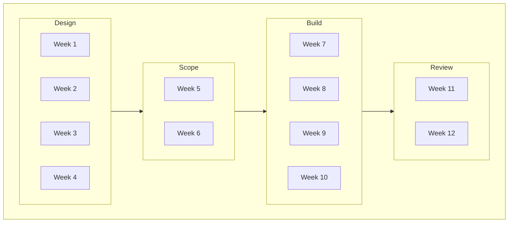

## Phases

1. Design
2. Scope
3. Build
4. Review

## Design

- Research
- Brief
- Proposals
  - Concepts
  - Prototypes
- Review
  - Charettes
- Revise
  - Research
  - Brief
  - Proposals

## Scope

- Identify
  - Tasks
  - Materials
  - Elements
    - Sensors
  - Methods
    - Fabrication
    - Robots
    - Manual Construction
- Assess
  - Barriers
  - Funding Sources
  - Skills
  - Estimates
  - Limitations
- Concretise
  - Schedule
    - Prototype
    - Fabricate
    - Install
    - Review
      - Milestones
      - Failures
    - Respond
    - Complete
  - Funding
  - Materials
    - Suppliers
  - Lifecycle

## Build

- Construct
  - Site
  - FabLab
  - Robotics Lab
  - Home
  - Contractors
- Install

## Review

- Document
  - Research
  - Proposals
  - Discussions
  - Drawings
  - Models
  - Protoypes
  - Photographs
  - Videos
- Reflect
  - Successes
  - Failures
  - Contributions
  - Research
  - Collaboration
